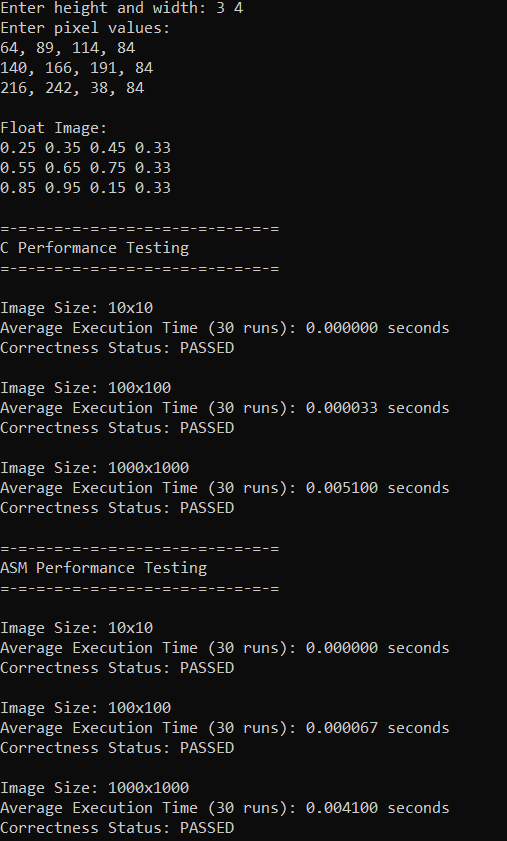
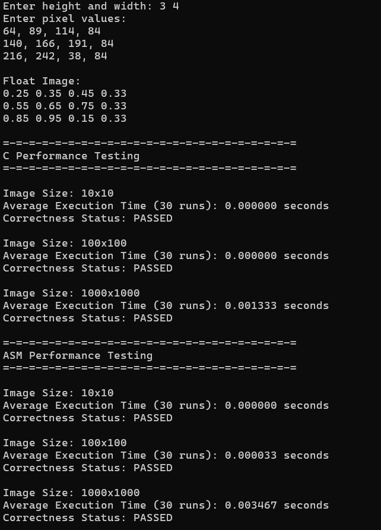

# LBYARCH_MP2
## Authors
| Name | GitHub |
| :--- | :--- |
| Lee, Ashley Fiona | [@20-ash](https://github.com/20-ash) |
| De Gracia, Kaleela Ysabel | [oresamu](https://github.com/oresamu) |

## Documentation
**Average Execution Time (30 runs, seconds)**
| Image Size | **C Implementation** | | **ASM Implementation** | |
|:---:|:---:|:---:|:---:|:---:|
| | *VivoBook M570DD* | *Nitro V15* | *VivoBook M570DD* | *Nitro V15* |
| **10×10** | 0.000000 | 0.000000 | 0.000000 | 0.000000 |
| **100×100** | 0.000033 | 0.000000 | 0.000067 | 0.000033 |
| **1000×1000** | 0.005100 | 0.001333 | 0.004100 | 0.003467 |

- **Performance Summary**

The program was tested on both members' laptops: the VivoBook M570DD and the Nitro V15. Both the C and Assembly implementations ran successfully and produced the expected output for all image sizes. For the 10×10 image, the execution time was too small to measure, so both implementations appeared to finish instantly. As the image size increased to 100×100, small performance differences started to become noticeable, with the Nitro V15 generally completing the tests faster.

The most noticeable difference was observed with the 1000×1000 image. On the VivoBook M570DD, the Assembly implementation performed better than the C version, reducing the execution time from 0.005100 s to 0.004100 s. On the Nitro V15, however, the C implementation finished faster than the Assembly version. Overall, the results show that the effect of Assembly optimization depends on the hardware being used, and its performance advantage may vary across different systems.

- **Program Execution and Output**

Refer to the images below for the benchmark results:

- **ASUS A (VivoBook M570DD)**

  

- **ASUS Nitro V15**

  

## Execution Video
